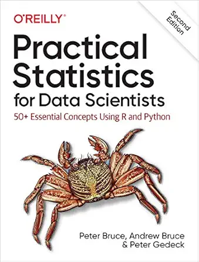

# Practical Statistics for Data Scientists: Summary Notes

**Original Authors:** Peter Bruce, Andrew Bruce, & Peter Gedeck

This repository contains a collection of Jupyter Notebooks summarizing practical concepts and implementations from the book **"Practical Statistics for Data Scientists"**. These notes are structured to provide hands-on examples of applying statistical methods to data science problems using Python, covering exploratory data analysis, sampling, experimentation, and machine learning models.

## 📂 Repository Structure

The summaries are divided into 7 main modules that align with the files in this repository:

* **`01_Exploratory_Data_Analysis.ipynb`**
    Techniques for summarizing and visualizing data, including estimates of location (mean, median) and variability (variance, standard deviation), as well as exploring data distributions.
* **`02_Data_and_Sampling_Distributions.ipynb`**
    Understanding the importance of random sampling, the Central Limit Theorem, bootstrapping techniques, and confidence intervals.
* **`03_Statistical_Experiments_and_Significance_Testing.ipynb`**
    Designing and analyzing A/B tests, hypothesis testing, understanding p-values, t-tests, and ANOVA.
* **`04_Regression_and_Prediction.ipynb`**
    Implementing simple and multiple linear regression, interpreting regression coefficients, dealing with confounding variables, and evaluating model predictions.
* **`05_Classification.ipynb`**
    Exploring techniques for classifying categorical outcomes using algorithms like Naive Bayes, Discriminant Analysis, and Logistic Regression, along with evaluating classification performance.
* **`06_Statistical_Machine_Learning.ipynb`**
    Building predictive models using K-Nearest Neighbors (KNN), Decision Trees, Random Forests, and boosting techniques like XGBoost.
* **`07_Unsupervised_Learning.ipynb`**
    Applying Unsupervised Learning techniques to discover patterns in data, utilizing Principal Components Analysis (PCA), K-Means clustering, and hierarchical clustering.

## 🛠️ System Requirements

To run the `.ipynb` files in this repository, it is recommended to set up a Python environment with the following libraries:
* `pandas`
* `numpy`
* `scipy`
* `statsmodels`
* `scikit-learn`
* `matplotlib`
* `seaborn`
* `jupyter`

---

## ⚠️ Disclaimer

This repository was created purely as personal study notes and a summary based on the book **"Practical Statistics for Data Scientists"** by **Peter Bruce, Andrew Bruce, & Peter Gedeck** (published by O'Reilly Media). [O'Reilly Media website](https://www.oreilly.com/)

All concepts, theoretical frameworks, and the general flow of the material discussed herein remain the intellectual property of the original authors and the publisher. This repository is not intended to serve as a substitute for the original material, but rather as a syntax reference and a supplementary summary. For a comprehensive and in-depth understanding of the subject matter, it is highly recommended to purchase and read the original book.
